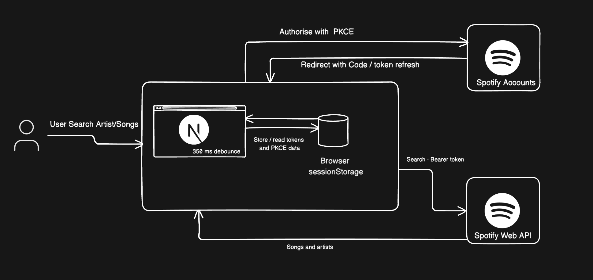
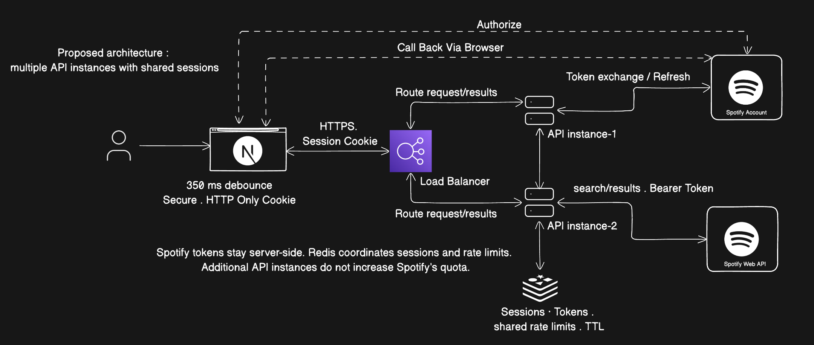

# Tunify

Find your next favourite song or artist with a simple, responsive Spotify search.

**[Open the live demo](https://tunifyapp.vercel.app/)**

Built with Next.js, React, TypeScript, and Tailwind CSS. Tunify exports to static files: authentication and search run entirely in the browser, with no application backend, database, or Spotify client secret.

## Features

- Search songs and artists as you type, with a 350 ms debounce.
- View artwork and open results in Spotify.
- Connect through Spotify's Authorization Code with PKCE flow.
- Clear loading, empty, and error states with retry or reconnect actions.
- Cancel outdated searches, refresh expired sessions, and respect rate limits.

Spotify sign-in is required for this app's search. Playback and library changes are outside its scope.

## Try the demo

Visit [tunifyapp.vercel.app](https://tunifyapp.vercel.app/), select **Connect Spotify**, then search for a song or artist.

**Reviewer access:** the Spotify app runs in development mode, so the app owner must add your Spotify account to its allowed users before you can search. A successful Spotify login alone does not guarantee API access. To run your own copy, follow the setup below.

## 1. Create a Spotify developer app

You need Node.js **22 or newer**, npm, and a Spotify account. Spotify currently requires the **app owner to have Premium** for a development-mode app to function. Development-mode apps support up to **five authorized users**. See [Spotify's development-mode requirements](https://developer.spotify.com/documentation/web-api/concepts/quota-modes).

1. Sign in to the [Spotify Developer Dashboard](https://developer.spotify.com/dashboard).
2. Choose **Create app**, enter a name and description, and select **Web API** if asked which API you will use.
3. Add this local redirect URI:

   ```text
   http://127.0.0.1:3000/
   ```

4. Accept the required terms and save the app.
5. Open the app's **Settings** and copy its **Client ID**. Tunify does not need the Client Secret.
6. In **Settings → Users Management**, add each tester's name and the email associated with their Spotify account, including the account you will use to test.

The redirect URI must match exactly, including the trailing slash. Use **127.0.0.1**, not `localhost`: Spotify permits HTTP for literal loopback addresses but does not accept `localhost` as a redirect. Hosted redirects must use HTTPS. See [Spotify's redirect URI rules](https://developer.spotify.com/documentation/web-api/concepts/redirect_uri).

## 2. Set up the environment

Clone or download this repository, open a terminal in its root folder, and install dependencies:

```sh
npm ci
```

Copy the example configuration:

```sh
cp .env.example .env.local
```

On Windows, you can duplicate `.env.example` manually and name the copy `.env.local`.

Edit `.env.local`:

```dotenv
NEXT_PUBLIC_SPOTIFY_CLIENT_ID=your_spotify_client_id
NEXT_PUBLIC_SPOTIFY_REDIRECT_URI=http://127.0.0.1:3000/
```

| Variable | Value |
| --- | --- |
| `NEXT_PUBLIC_SPOTIFY_CLIENT_ID` | The Client ID from your Spotify app settings. |
| `NEXT_PUBLIC_SPOTIFY_REDIRECT_URI` | The exact root URL registered with Spotify for this environment. |

Both values are **public configuration** and are included in the browser build. Keep the `NEXT_PUBLIC_` prefix. **Do not add a Spotify Client Secret**; PKCE does not require one. `.env.local` is ignored by Git, while `.env.example` contains placeholders for setup.

Restart the development server after changing these values. Hosted builds must be rebuilt/redeployed because public environment variables are bundled at build time.

## 3. Run locally

```sh
npm run dev
```

Open **[http://127.0.0.1:3000/](http://127.0.0.1:3000/)**.

1. Select **Connect Spotify** and complete Spotify authorization.
2. Spotify returns you to the root page, which completes sign-in automatically.
3. Type a song or artist, such as `Fleetwood Mac`. Results appear after you pause typing.
4. Select a result to open it in Spotify.
5. Select **Logout** to clear Tunify's session. This does not log you out of Spotify itself.

There is no separate callback route to configure: use the root URL above, not `/api/auth/callback/tunify`.

## Checks and production preview

Run all automated checks and create the production build:

```sh
npm run check
```

Then stop any running development server and preview the static build:

```sh
npm start
```

The preview is available at **[http://127.0.0.1:3000/](http://127.0.0.1:3000/)**. It serves the generated `out/` directory and does not provide an application backend.

| Command | Purpose |
| --- | --- |
| `npm run dev` | Start the development server. |
| `npm run lint` | Run ESLint. |
| `npm run typecheck` | Check TypeScript types. |
| `npm test` | Run mocked authentication and search tests. |
| `npm run build` | Export the production site to `out/`. |
| `npm run check` | Run lint, type checking, tests, and the production build. |
| `npm start` | Preview an existing production build. |

Tests cover PKCE, callback validation, refresh behavior, logout races, rate limits, malformed token responses, cancellation, and request timeouts. They do not call live Spotify. Verify live login, browser Back after starting login, search, logout, and reviewer account access manually.

## Deploy on Vercel

1. Import the repository into Vercel using the Next.js framework preset. The project is configured for a static export.
2. Add these environment variables for **Production**:

   ```dotenv
   NEXT_PUBLIC_SPOTIFY_CLIENT_ID=your_spotify_client_id
   NEXT_PUBLIC_SPOTIFY_REDIRECT_URI=https://tunifyapp.vercel.app/
   ```

3. If Vercel asks whether these are **Secret** or **Config**, choose **Config**. These two values are intentionally public; do not remove their prefixes or enter a client secret.
4. In your Spotify app settings, add **`https://tunifyapp.vercel.app/`** as another redirect URI and save. Keep the local redirect too if you still develop locally.
5. Deploy, then test sign-in using the production URL.

For your own deployment, replace `https://tunifyapp.vercel.app/` in both places with your actual site URL. The browser's origin must match the configured redirect origin. A preview URL cannot use a production-domain callback with this app; use a stable registered URL and matching environment configuration to test authentication.

See [Vercel's framework environment variable documentation](https://vercel.com/docs/environment-variables/framework-environment-variables) for public variable behavior.

## Troubleshooting

| Problem | What to check |
| --- | --- |
| Missing configuration | Create `.env.local`, fill in both variables, and restart the server. On Vercel, check the deployment environment and redeploy. |
| Invalid redirect URI | Match the Spotify dashboard and environment variable exactly, including scheme, host, port, path, and trailing slash. |
| Login reports an origin mismatch | Open the configured URL. Locally, use `127.0.0.1:3000` instead of `localhost:3000`. |
| Login works but search is forbidden (403) | Add the signed-in Spotify account under Users Management and check the app owner's Premium status. |
| Too many requests (429) | Wait for the displayed cooldown, then retry. |
| Request times out or connection fails | Check your connection and retry. Requests have a 15-second timeout. |
| Session cannot be renewed | Connect Spotify again. Temporary network failures preserve the session. |
| Production preview fails | Run `npm run build` first and stop the development server so port 3000 is free. |

## Architecture

Select a diagram to view it at full size.

### Current architecture — implemented

The browser handles PKCE authentication, session storage, and debounced Spotify searches. Vercel serves the static app. Authorization returns a code; token exchange and refresh are separate browser requests.

<a href="readme_images/simple_arch.png">
  
</a>


### Future architecture — proposed

A backend could move Spotify tokens into server-side sessions, with Redis sharing sessions and rate limits across API instances. This adds hosting and operational complexity and is not part of the current implementation.

<a href="readme_images/future_imp.png">
  
</a>

Each API instance would access Redis and both Spotify services independently. The authorization callback travels through the browser to the backend; API instances do not need to call each other. Additional instances do not increase Spotify's quota.


## Project structure

```text
src/
  app/                  Root page, layout, and shared styles
  components/
    auth/               Session provider and connect button
    layout/             Navigation and footer
    search/             Search input, welcome state, and results
    ui/                 Shared error alert
  lib/spotify/
    auth/               PKCE, callback, token storage, refresh, and logout
    api/                Spotify search requests
    config.ts           Public environment configuration
    request.ts          Request timeouts and retry timing
    types/              Spotify response types
scripts/preview.mjs     Static production preview server
tests/spotify.test.mjs   Mocked authentication and search tests
```

Tokens are stored in tab-scoped `sessionStorage` for reload continuity. Search requests return up to ten songs and ten artists and currently use the Australian market (`AU`). No personal-data scopes are requested.

## AI assistance

AI assisted with implementation, refactoring, and code review. The original prompts and conversation history should be supplied separately with the assessment submission, with credentials and personal information removed. This README is setup documentation, not an AI transcript.

## Spotify documentation

- [Create and configure an app](https://developer.spotify.com/documentation/web-api/concepts/apps)
- [Authorization Code with PKCE](https://developer.spotify.com/documentation/web-api/tutorials/code-pkce-flow)
- [Refresh access tokens](https://developer.spotify.com/documentation/web-api/tutorials/refreshing-tokens)
- [Search API](https://developer.spotify.com/documentation/web-api/reference/search)
